# Hướng dẫn sử dụng — Smart Laundry Locker (Gửi & Giữ đồ qua tủ)

> Tài liệu hướng dẫn cho người dùng cuối. Ảnh chụp thật từ ứng dụng chạy trên
> Android (emulator Pixel 4), kết nối backend + **IoT tủ khoá phản hồi thật**.
> Cập nhật: 2026-07-02.

Ứng dụng giúp bạn **gửi hàng cho người khác qua tủ khoá thông minh (SEND)** và
**thuê ô để giữ đồ theo giờ (RENTAL)**. Mỗi ô tủ mở bằng **mã PIN / mã QR**, và
bạn có thể bấm **"Mở tủ"** ngay trong app để tủ tự mở (không cần nhập tay tại tủ).

---

## 1. Trang chủ

Sau khi đăng nhập, bạn vào Trang chủ:

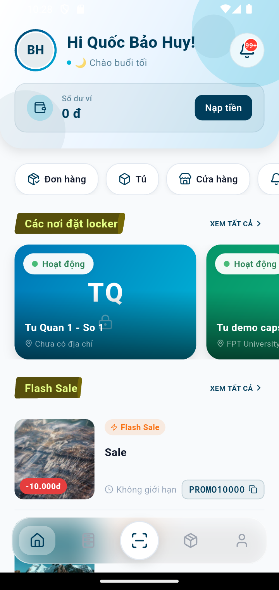

- **Số dư ví** + nút **Nạp tiền** ở đầu trang.
- Hàng phím tắt: **Đơn hàng · Tủ · Cửa hàng · Thông báo · Ưu đãi**.
- **Các nơi đặt locker**: danh sách cửa hàng/điểm đặt tủ gần bạn.
- **Flash Sale**: mã giảm giá đang có (chạm để sao chép mã).
- Thanh điều hướng dưới cùng: **Trang chủ · Đơn · Quét mã · Tủ · Hồ sơ**.

> **Đăng nhập/Đăng ký:** ở màn hình đầu tiên, nhập **Email/SĐT + mật khẩu** rồi
> bấm **Đăng nhập**; hoặc chọn tab **Đăng ký** để tạo tài khoản mới; hoặc đăng
> nhập nhanh bằng **Google / Số điện thoại (OTP)**.

---

## 2. Gửi hàng qua tủ (SEND)

### Bước 1 — Chọn cửa hàng và xem ô trống

Trang chủ → **Cửa hàng** (hoặc chạm một điểm trong "Các nơi đặt locker") → chọn
tủ → app hiển thị **sơ đồ ô** của tủ đó. Ô **xanh = Trống**, xám = đang dùng,
vàng = đã đặt, đỏ = lỗi, tím = ô Drone.

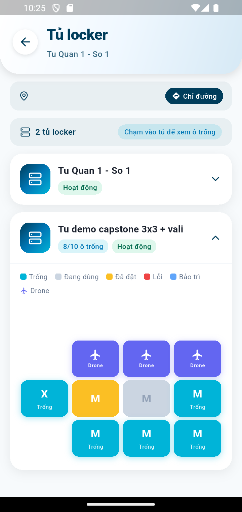

### Bước 2 — Chọn ô trống và chọn dịch vụ

Chạm một **ô Trống** → hộp thoại hiện thông tin ô (kích cỡ, vị trí, trạng thái)
và hỏi bạn muốn làm gì:

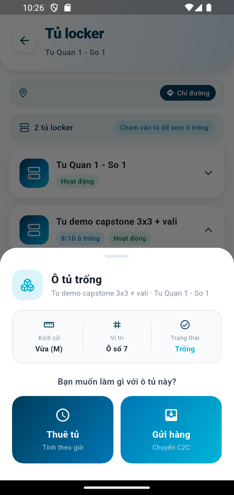

- **Thuê tủ** — giữ đồ của bạn, tính tiền theo giờ.
- **Gửi hàng** — gửi cho người khác (chuyển C2C). Chọn mục này để tiếp tục.

### Bước 3 — Điền thông tin gửi hàng

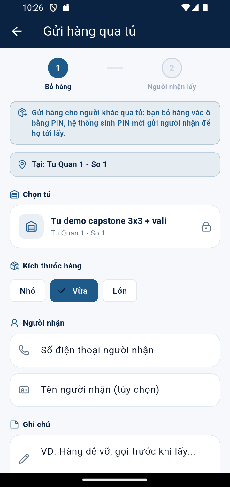

- Chọn **Kích thước hàng** (Nhỏ / Vừa / Lớn).
- Nhập **Số điện thoại người nhận** (bắt buộc) và **Tên người nhận** (tùy chọn).
- Nhập **Ghi chú** nếu cần (VD: hàng dễ vỡ).
- (Tùy chọn) nhập **Mã giảm giá**.
- Bấm **Tạo đơn & lấy PIN bỏ hàng**.

Sau khi tạo, đơn ở trạng thái **Khởi tạo** và phí gửi mặc định **15.000đ**.

### Bước 4 — Thanh toán (bắt buộc trước khi bỏ hàng)

> ⚠️ **Mới:** bạn phải **thanh toán trước khi bỏ hàng vào tủ**. Nếu bấm "Đã bỏ
> hàng" khi chưa trả tiền, hệ thống báo: *"Vui lòng thanh toán đơn trước khi bỏ
> hàng vào tủ."*

Mở chi tiết đơn → bấm **Thanh toán** → chọn phương thức:
**Ví của tôi / VNPay / MoMo / Tiền mặt**. Ví và Tiền mặt thanh toán tức thì;
VNPay/MoMo mở cổng thanh toán. Sau khi trả xong, đơn chuyển **Đã thanh toán**.

### Bước 5 — Xem đơn của bạn

Vào tab **Đơn** (dưới cùng) để xem tất cả đơn. Đơn vừa tạo hiển thị
**"Gửi hàng · Đang trong tủ · Tủ 2 · Ô 17 · 15.000đ"**:

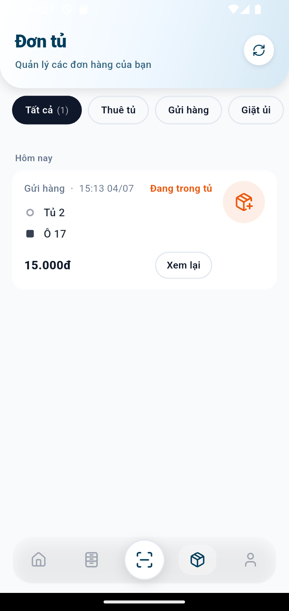

### Bước 6 — Mở tủ để bỏ hàng vào ô

Chạm đơn để mở chi tiết. Bạn thấy **mã QR** và **mã PIN** (ví dụ `4 8 0 0 8 7`),
cùng nút **Mở tủ**:

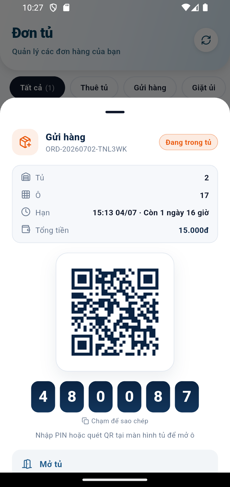

Có **2 cách mở ô**:
1. Tới tủ, **nhập PIN** hoặc **quét QR** tại màn hình tủ; **hoặc**
2. Bấm **Mở tủ** ngay trong app — ứng dụng gửi lệnh mở xuống tủ, tủ **tự mở cửa**.

Sau khi bấm **Mở tủ**, app xác nhận đã gửi lệnh và **cửa ô mở ra**:

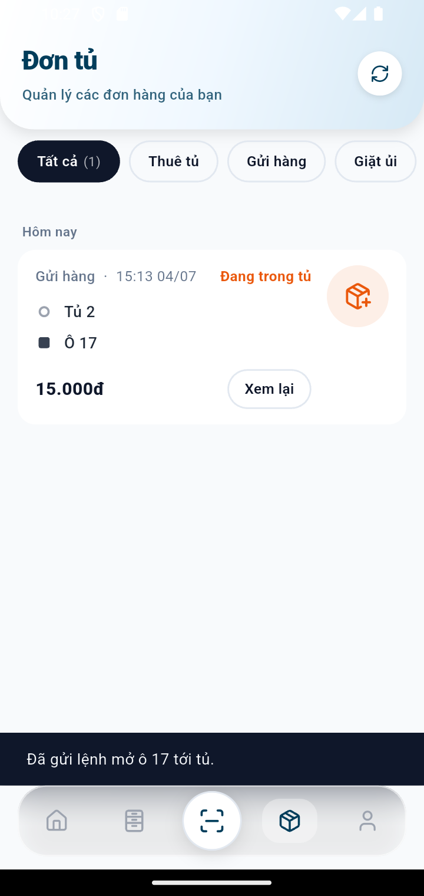

Bỏ hàng vào ô, đóng cửa, rồi bấm **"Tôi đã bỏ hàng vào ô"**. Hệ thống **sinh PIN
nhận hàng mới** và gửi cho người nhận.

---

## 3. Người nhận lấy hàng

- Người nhận nhận **thông báo + PIN/QR nhận hàng** (nếu đã có tài khoản), hoặc
  bạn tự chuyển mã PIN cho họ.
- Người nhận tới tủ, **nhập PIN / quét QR** (hoặc bấm **Mở tủ** trong app của họ)
  để mở ô, lấy hàng.
- Sau khi lấy, bấm **"Tôi đã lấy đồ — hoàn tất"**; đơn chuyển **Hoàn thành**, ô
  tủ được giải phóng.

---

## 4. Thuê ô giữ đồ (RENTAL) — tóm tắt

Tương tự Gửi hàng nhưng chọn **Thuê tủ** ở Bước 2:
1. Chọn **loại ô** (thường / vali XL) và **số giờ thuê**.
2. Bấm **Thuê ngay** → nhận **PIN dùng nhiều lần** trong suốt kỳ thuê.
3. Thanh toán → bấm **bắt đầu kỳ thuê** → dùng nút **Mở tủ** để mở ô bất cứ lúc nào.
4. Khi xong: **Gia hạn** thêm giờ, hoặc **Kết thúc thuê & trả ô**.

---

## 5. Quên mật khẩu — đặt lại bằng OTP email

Nếu quên mật khẩu, bạn tự đặt lại ngay trong app (không cần liên hệ hỗ trợ):

### Bước 1 — Mở luồng đặt lại

Ở màn hình đăng nhập, bấm **"Quên mật khẩu?"** (góc phải, dưới ô Mật khẩu):

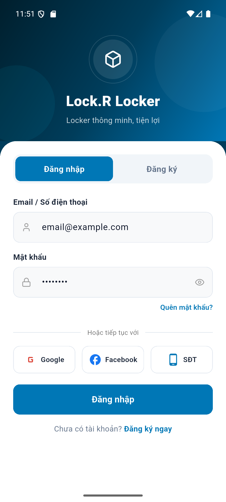

### Bước 2 — Nhập email nhận mã OTP

Nhập **email đã đăng ký tài khoản** rồi bấm **Gửi mã OTP**:

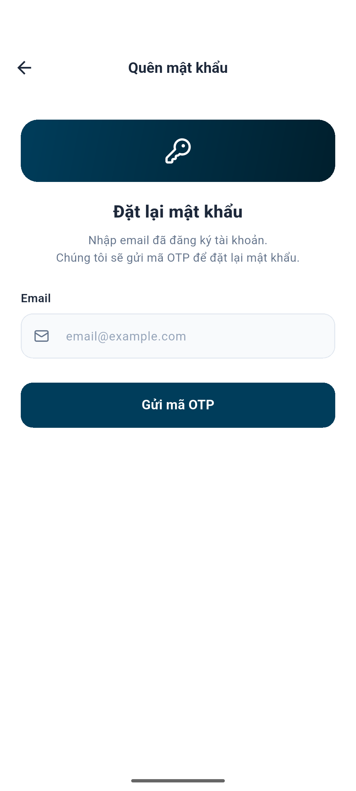

### Bước 3 — Nhập OTP + mật khẩu mới

Hệ thống gửi **mã OTP 6 chữ số** về email của bạn (hết hạn sau **5 phút**).
Nhập OTP, đặt **mật khẩu mới** (tối thiểu 6 ký tự) và nhập lại lần nữa, rồi bấm
**Đặt lại mật khẩu**. Không nhận được mã? Bấm **Gửi lại mã OTP**.

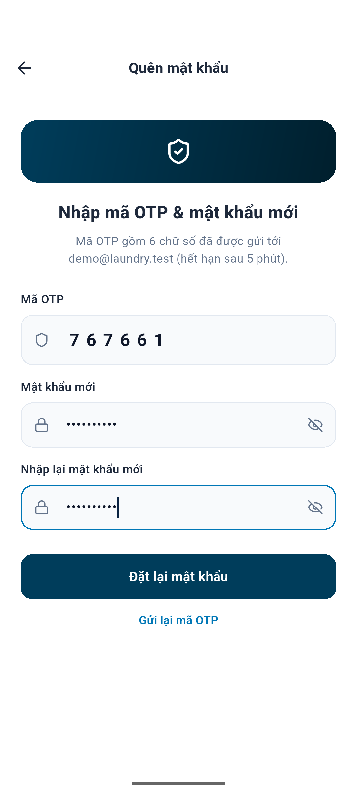

### Bước 4 — Đăng nhập bằng mật khẩu mới

App báo *"Đặt lại mật khẩu thành công"* và quay về màn đăng nhập — đăng nhập
bằng **mật khẩu mới** như bình thường:

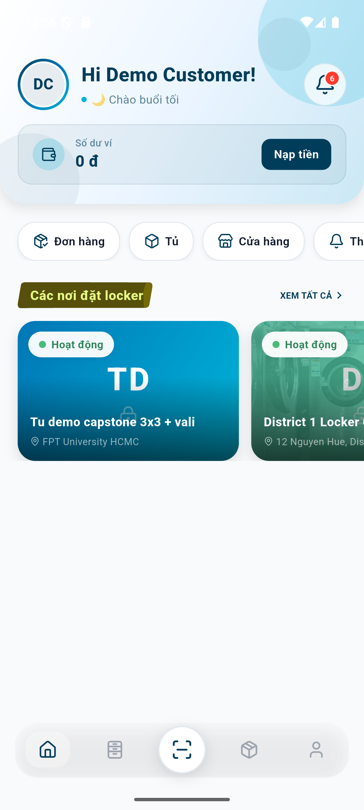

> 🔒 Sau khi đổi mật khẩu, mọi phiên đăng nhập cũ trên thiết bị khác bị đăng
> xuất (thu hồi token) để bảo vệ tài khoản.

---

## 6. Quá hạn lấy hàng — đồ được chuyển vào kho

Mỗi đơn có **hạn lấy hàng** (gửi hàng: 48h; thuê tủ: theo số giờ thuê). Quá hạn:

1. Hệ thống **nhắc qua thông báo** và bắt đầu tính **phí quá hạn** theo giờ
   (có mức trần).
2. Nếu quá hạn **quá 24 giờ**, hệ thống tự động: chốt phí quá hạn vào đơn,
   chuyển đơn sang **Quá hạn**, **chuyển đồ vào kho lưu trữ** và **giải phóng ô
   tủ** cho khách khác (mã PIN cũ hết hiệu lực). Bạn nhận được thông báo:

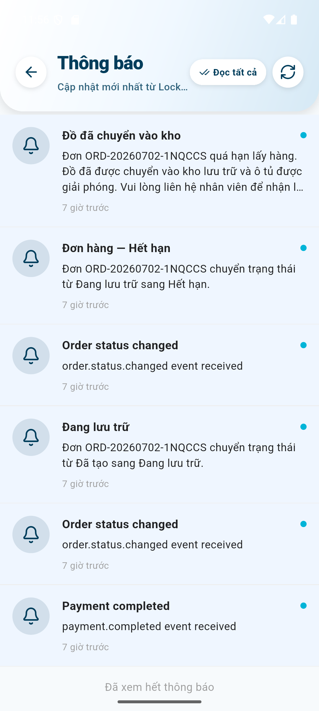

Trong danh sách đơn, đơn quá hạn hiển thị nhãn **Quá hạn** màu đỏ kèm cảnh báo
phí (ví dụ dưới đây: phí thuê 5.000đ + phí quá hạn 2.500đ = 7.500đ):

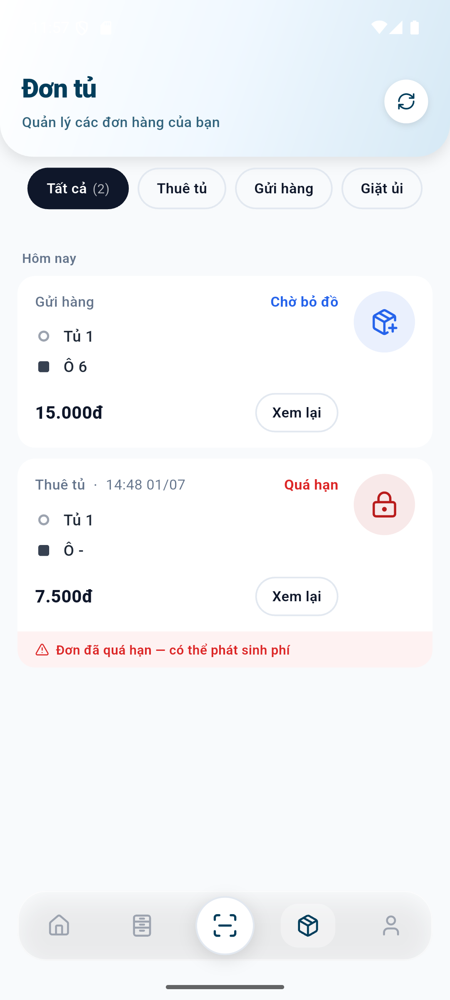

> 📦 **Nhận lại đồ:** liên hệ nhân viên tại điểm đặt tủ — nhân viên trao trả đồ
> từ kho và hoàn tất đơn (thanh toán nốt phí quá hạn nếu chưa trả).

---

## 7. Dành cho Quản lý (Manager) — thao tác đơn hàng

Tài khoản **MANAGER** đăng nhập sẽ vào màn **Quản lý vận hành** (Thống kê ·
Sơ đồ tủ · Đơn hàng). Tab **Đơn hàng** giờ cho phép **đổi trạng thái đơn**
(trước đây chỉ xem):

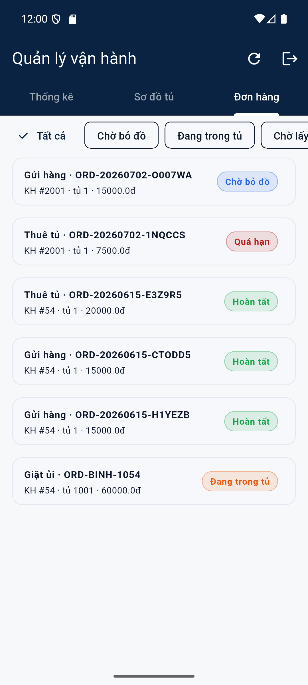

**Chạm vào một đơn** → bottom sheet hiện thông tin đơn + các trạng thái:
*Chờ bỏ đồ · Đang trong tủ · Chờ lấy · Quá hạn · Hoàn tất · Đã hủy*.
Chọn trạng thái mới rồi bấm **Xác nhận**:

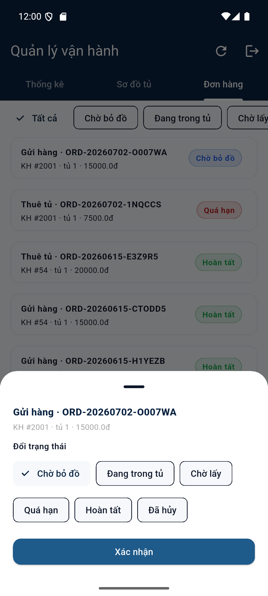

App báo kết quả và cập nhật ngay danh sách (đơn ví dụ chuyển từ *Chờ bỏ đồ*
sang *Đang trong tủ*):

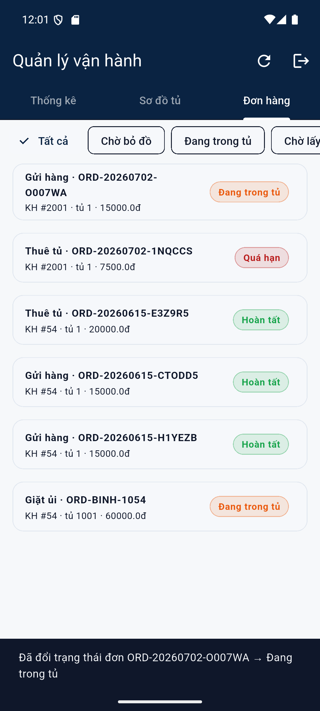

> 👤 Mỗi lần Manager đổi trạng thái đều được **ghi vào lịch sử đơn** (ai đổi,
> lúc nào) để đối soát về sau. Khách hàng nhận thông báo khi trạng thái đổi.

---

## 8. Ghi chú kỹ thuật — Chuỗi Mobile → Backend → IoT

Nút **"Mở tủ"** không chỉ hiển thị PIN mà thực sự điều khiển tủ khoá:

```
App (bấm "Mở tủ")
   → POST /api/iot/unlock  (lockerId, boxId, pinCode)
   → iot-service xác minh PIN, publish lệnh MQTT "OPEN" tới tủ
   → Tủ (cabinet) mở cửa và PHẢN HỒI kết quả về hệ thống
```

Nhật ký tủ khoá (cabinet) khi nhận lệnh mở từ thao tác trên app — **tủ phản hồi
thật** (không phải mô phỏng phía app):

```
[SIM] OPEN request: locker=2 box=17 commandId=108547b8-...
[SIM] OK -> cabinet/2/command/open/result:
      {"status":"SUCCESS","hwState":"OPENING","errorMessage":"Simulated: door opened"}
[SIM] HW state -> cabinet/2/locker/17/status: box=17 OPEN
```

Nghĩa là: khi bạn bấm **Mở tủ** trên điện thoại, backend gọi xuống tủ và **tủ trả
lời "đã mở cửa"** — đúng luồng vận hành thật của tủ khoá thông minh.

Không chỉ lệnh mở tủ — **mọi thay đổi trạng thái ô** (giữ chỗ, có đồ, giải
phóng) đều được backend **đồng bộ xuống tủ** để màn hình tủ luôn khớp hệ thống.
Ví dụ nhật ký tủ khi job đối soát/quá hạn của backend giải phóng ô:

```
[SIM] SYNC: cabinet display updated -> locker=1 box=5 state=AVAILABLE   (đơn quá hạn → nhả ô)
[SIM] SYNC: cabinet display updated -> locker=1 box=8 state=AVAILABLE   (job đối soát nhả ô mồ côi)
[SIM] HW state -> cabinet/1/locker/6/status: box=6 OPEN                 (bấm "Mở tủ" → cửa mở)
```

Hệ thống còn có các **job tự động chạy nền** giữ tủ luôn "sạch":
- Tự hủy đơn bỏ dở sau 24h và nhả ô (mỗi 15 phút).
- Chuyển đơn quá hạn >24h vào kho + nhả ô (mỗi giờ).
- Đối soát trạng thái ô ↔ đơn hai chiều, tự sửa lệch (mỗi giờ).

> Ảnh chụp trong tài liệu này được thực hiện trên môi trường chạy đầy đủ:
> ứng dụng mobile ↔ backend (Docker) ↔ tủ khoá IoT (qua MQTT).
