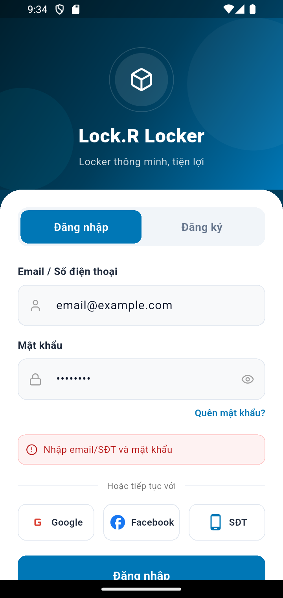
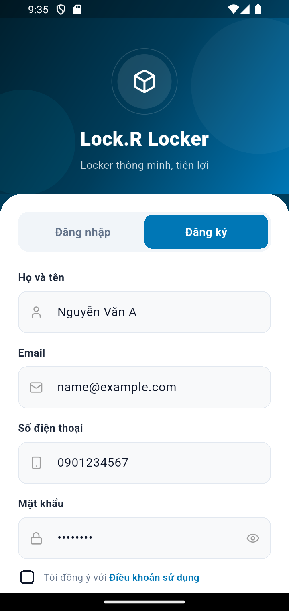
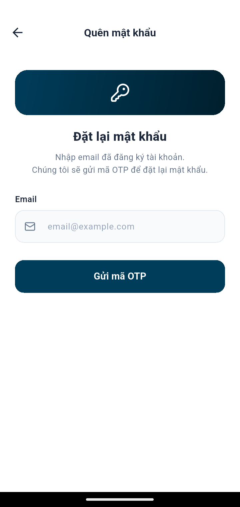

# Kịch bản 0 — Xác thực (Đăng nhập / Đăng ký / Quên mật khẩu)

**Vai trò:** áp dụng cho **mọi vai trò** — màn hình đầu tiên khi mở app hoặc sau khi đăng xuất.

---

## Bước 1 — Màn hình đăng nhập

Màn hình mở đầu **Lock.R Locker**. Có:
- Hai tab: **Đăng nhập** (đang chọn) và **Đăng ký**.
- Ô **Email / Số điện thoại** và ô **Mật khẩu** (biểu tượng con mắt để hiện/ẩn).
- Link **Quên mật khẩu?** (góc phải dưới ô mật khẩu).
- Đăng nhập nhanh **Google / Facebook / SĐT** (OTP qua Firebase).
- Nút **Đăng nhập** màu xanh.

> Nhập email + mật khẩu của vai trò tương ứng rồi bấm **Đăng nhập**. App tự
> điều hướng vào Home đúng vai trò (Admin/Manager/Maintenance/Technician/Customer).

---

## Bước 2 — Tab Đăng ký (khách tự tạo tài khoản)

Chạm tab **Đăng ký** để tạo tài khoản mới. Biểu mẫu gồm: **Họ và tên**, **Email**,
**Số điện thoại**, **Mật khẩu**, và ô tick **đồng ý Điều khoản sử dụng**.

> Tài khoản tự đăng ký luôn có vai trò **CUSTOMER**. Các vai trò vận hành
> (Admin/Manager/Maintenance) do Admin cấp (xem [04-admin.md](04-admin.md)).

---

## Bước 3 — Quên mật khẩu (đặt lại bằng OTP email)

Ở màn đăng nhập bấm **Quên mật khẩu?** → mở màn **Đặt lại mật khẩu**:

- Nhập **email đã đăng ký** → bấm **Gửi mã OTP**.
- Hệ thống gửi **mã OTP 6 số** về email (hết hạn 5 phút).
- Bước kế: nhập OTP + **mật khẩu mới** (≥6 ký tự) → **Đặt lại mật khẩu**.

> 🔒 Sau khi đổi mật khẩu, backend thu hồi mọi phiên đăng nhập cũ để bảo vệ tài khoản.
