# Kịch bản 1 — Khách hàng (Customer): Gửi hàng qua tủ → Thanh toán → Mở tủ

**Vai trò:** CUSTOMER (`nqbhuy2004nt@gmail.com`).
**Mục tiêu:** gửi một món hàng cho người khác qua tủ khoá, thanh toán, và mở ô tủ ngay trong app (tủ IoT phản hồi thật).

---

## Bước 1 — Trang chủ

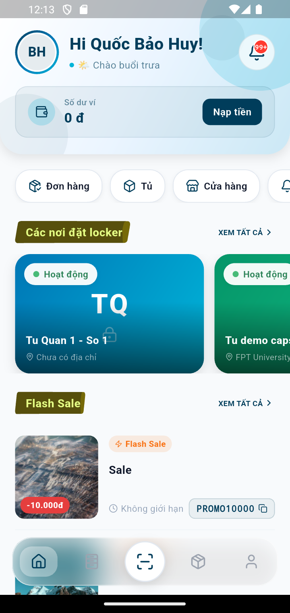

Sau đăng nhập, khách vào Trang chủ: lời chào + **Số dư ví** và nút **Nạp tiền**;
hàng phím tắt **Đơn hàng · Tủ · Cửa hàng · Thông báo**; danh sách **Các nơi đặt
locker**; mục **Flash Sale** (mã giảm giá). Thanh điều hướng dưới: Trang chủ ·
Tủ · Quét mã · Đơn · Hồ sơ.

## Bước 2 — Chọn cửa hàng

Chạm **Cửa hàng** → danh sách điểm đặt tủ (tên, địa chỉ, trạng thái **Mở cửa**):

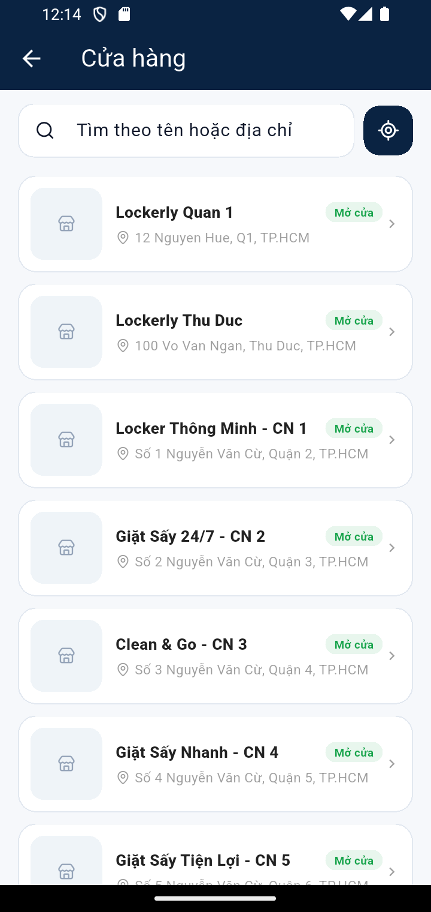

Chạm một cửa hàng → **Chi tiết cửa hàng** (địa chỉ, nút **Chỉ đường** và **Xem tủ**):

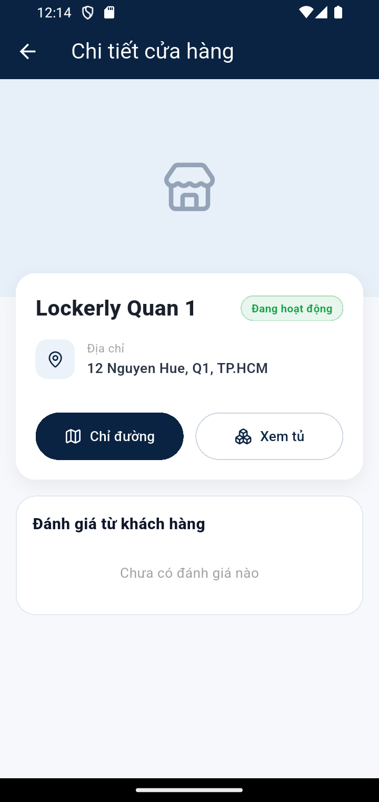

## Bước 3 — Xem sơ đồ ô và chọn ô trống

Bấm **Xem tủ** → chọn một tủ → app bung **sơ đồ ô**. Chú giải màu: **xanh = Trống**,
xám = đang dùng, vàng = đã đặt, đỏ = lỗi, tím = ô Drone.

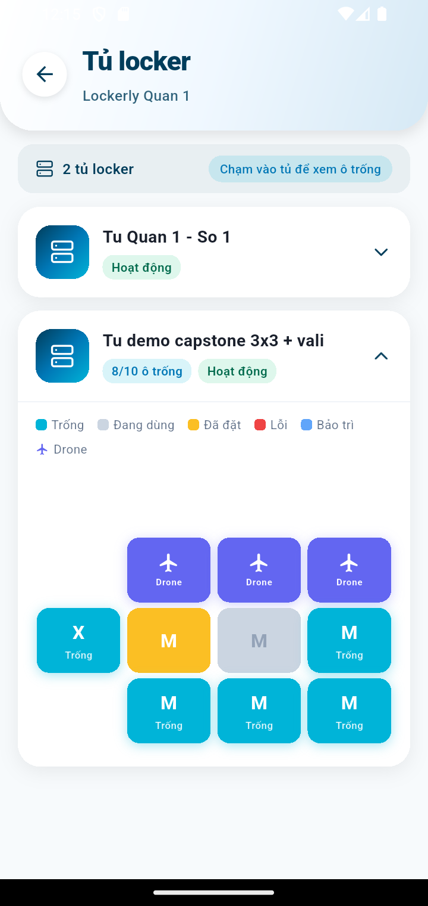

Chạm một **ô Trống** → hộp thoại thông tin ô (kích cỡ, vị trí, trạng thái) và
2 lựa chọn dịch vụ: **Thuê tủ** (giữ đồ theo giờ) hoặc **Gửi hàng** (chuyển C2C):

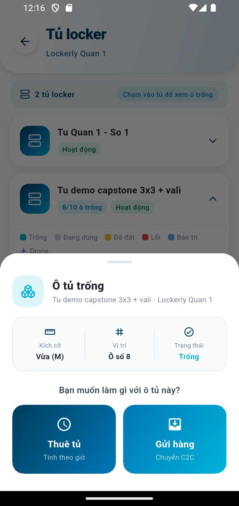

## Bước 4 — Điền thông tin gửi hàng

Chọn **Gửi hàng** → biểu mẫu: kích thước hàng (Nhỏ/Vừa/Lớn), **SĐT người nhận**
(bắt buộc), tên người nhận, ghi chú, mã giảm giá. Phí gửi mặc định **15.000đ**.

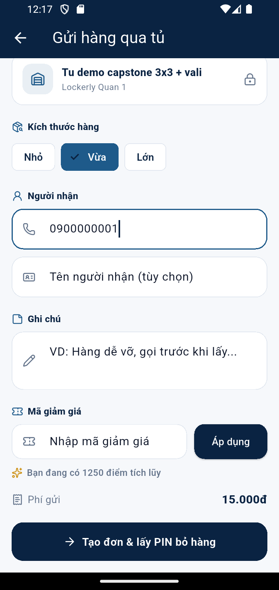

Bấm **Tạo đơn & lấy PIN bỏ hàng** → đơn được tạo (trạng thái **Chờ bỏ đồ**).

## Bước 5 — Chi tiết đơn: PIN + QR

Mở đơn trong tab **Đơn tủ** → chi tiết hiển thị **mã QR** và **mã PIN** để mở ô:

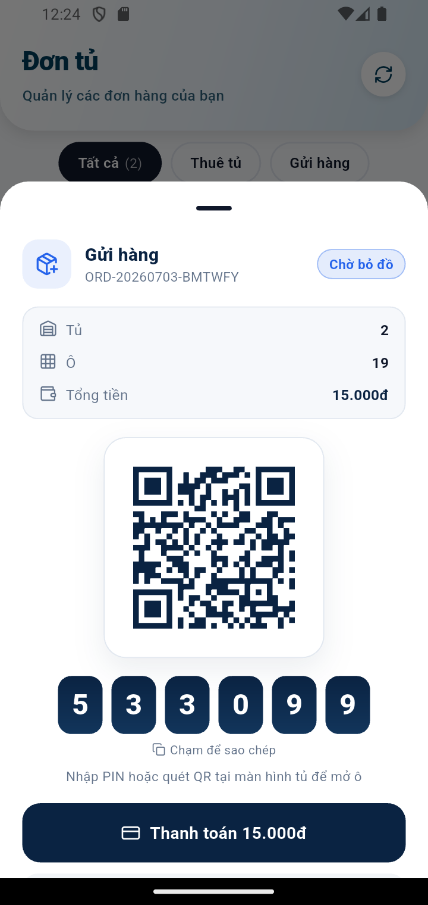

## Bước 6 — Thanh toán (bắt buộc trước khi bỏ hàng)

> ⚠️ Phải **thanh toán trước khi bỏ hàng**. Bấm **Thanh toán** → bộ chọn phương thức:

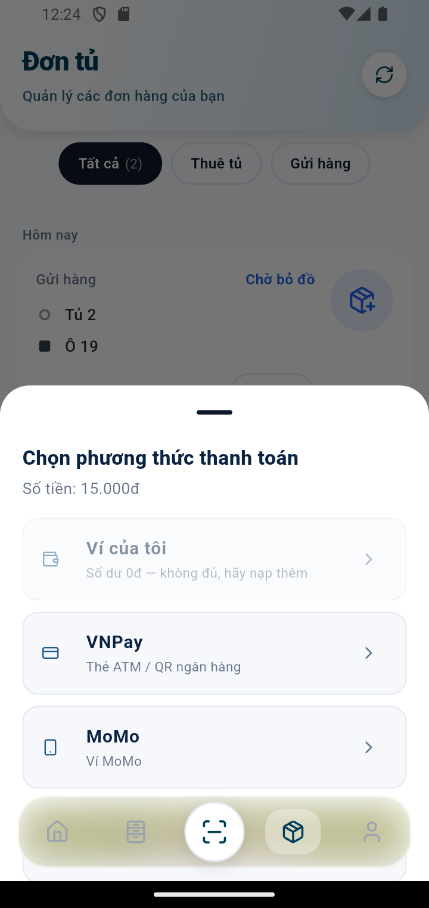

**Ví của tôi / VNPay / MoMo / Tiền mặt**. Ví và Tiền mặt settle tức thì;
VNPay/MoMo mở cổng thanh toán. Sau khi trả, đơn chuyển **Đã thanh toán**.

## Bước 7 — Mở tủ (mobile → backend → IoT)

Sau khi thanh toán, đơn chuyển **Đang trong tủ**. Chi tiết đơn có nút **Mở tủ**:

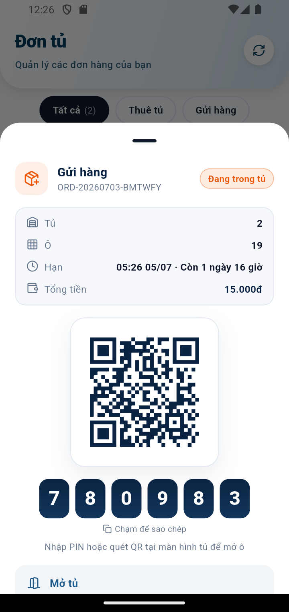

Có **2 cách mở ô**: (1) nhập PIN / quét QR tại màn hình tủ; **hoặc** (2) bấm
**Mở tủ** ngay trong app. Khi bấm **Mở tủ**, app gửi lệnh xuống tủ và **tủ tự mở**:

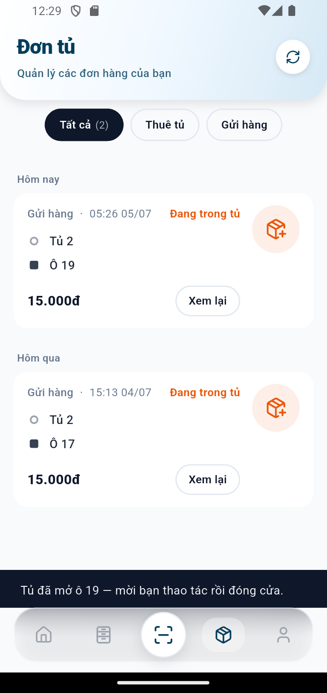

Thông báo **"Tủ đã mở ô 19 — mời bạn thao tác rồi đóng cửa."** — đây là kết quả
**thật** từ phần cứng tủ (không phải mô phỏng phía app). Bỏ hàng vào ô, đóng cửa,
rồi bấm **"Tôi đã bỏ hàng vào ô"**; hệ thống sinh PIN nhận hàng mới cho người nhận.

> **Chuỗi kỹ thuật:** App bấm "Mở tủ" → `POST /api/iot/unlock` → iot-service xác
> minh PIN + publish lệnh MQTT "OPEN" → tủ (cabinet) mở cửa & **phản hồi**
> `SUCCESS/door opened` về hệ thống → app hiển thị đúng kết quả.

---

## Hồ sơ & Bảo mật (tính năng cá nhân)

Tab **Hồ sơ**: thông tin tài khoản + menu Tài khoản/Quản lý/Cài đặt/Hỗ trợ:

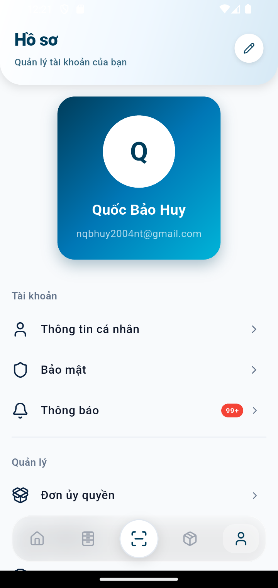

Vào **Bảo mật** → có công tắc **Khóa ứng dụng bằng sinh trắc học** (vân tay/khuôn
mặt của thiết bị) + phần **Đổi mật khẩu**:

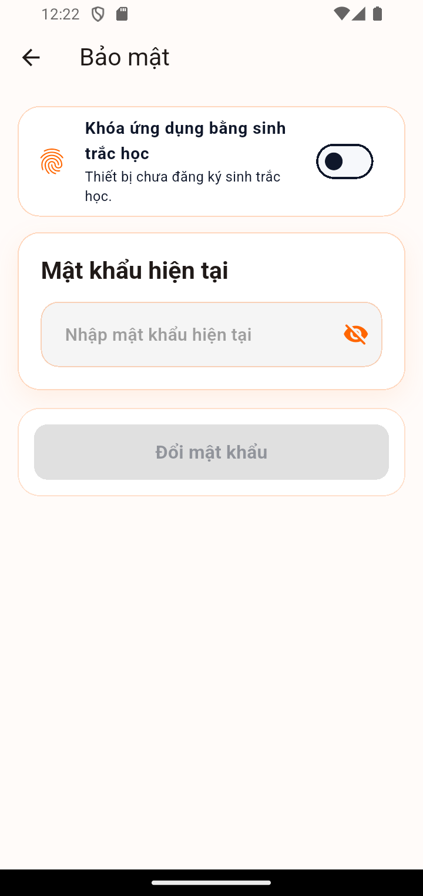

> Bật công tắc → mỗi lần mở app phải xác thực vân tay/khuôn mặt mới vào được Home.
> (Ảnh chụp trên emulator nên báo "Thiết bị chưa đăng ký sinh trắc học" — trên
> máy thật đã đăng ký vân tay thì công tắc bật bình thường.)

---

## Bàn giao cho người nhận

Người nhận (một khách khác) nhận **thông báo + PIN/QR nhận hàng**, tới tủ nhập
PIN / quét QR / bấm **Mở tủ** để lấy hàng, rồi bấm **"Tôi đã lấy đồ — hoàn tất"**;
đơn chuyển **Hoàn thành**, ô tủ được giải phóng.
