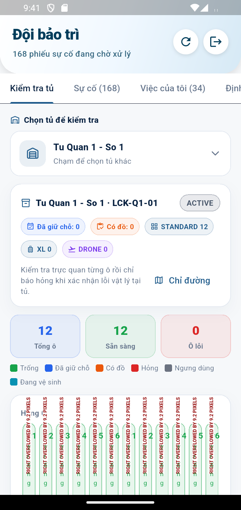
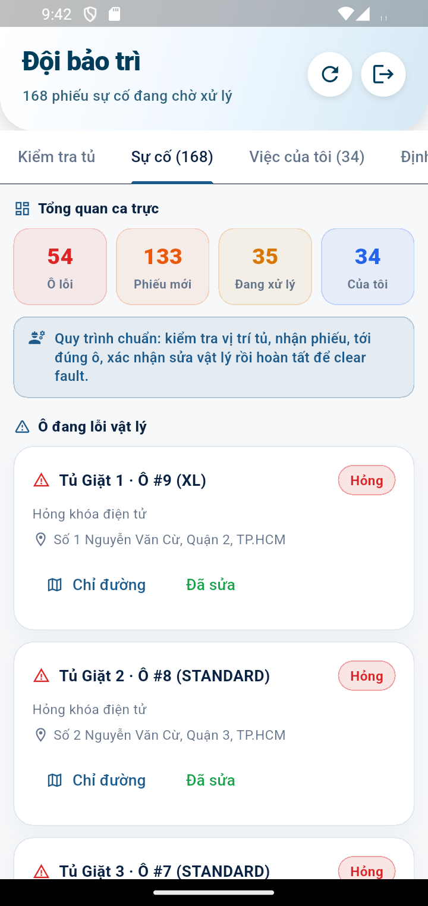
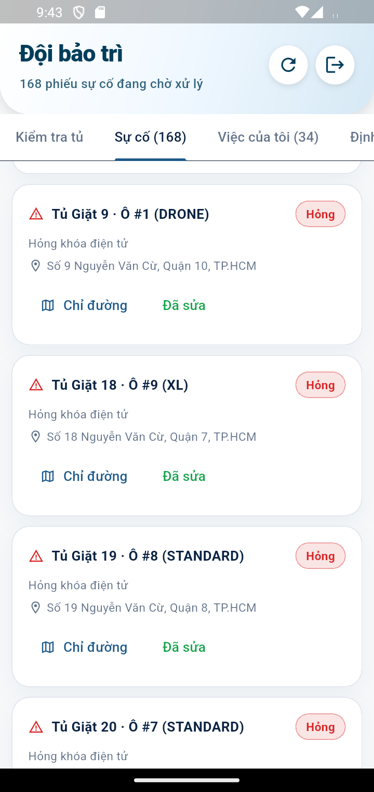
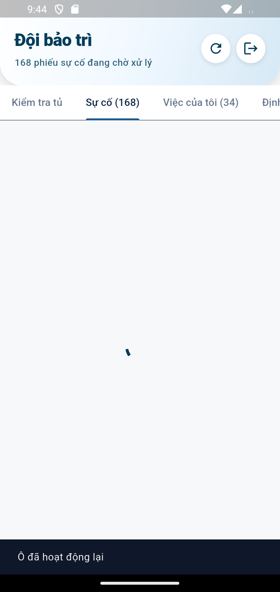
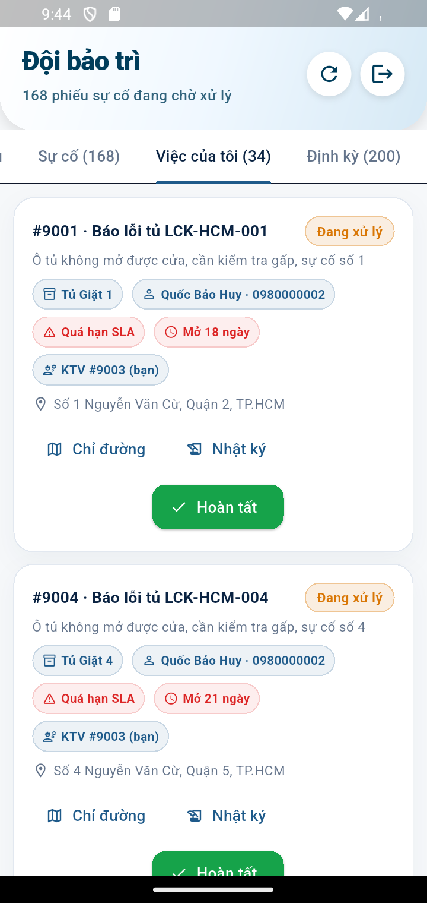
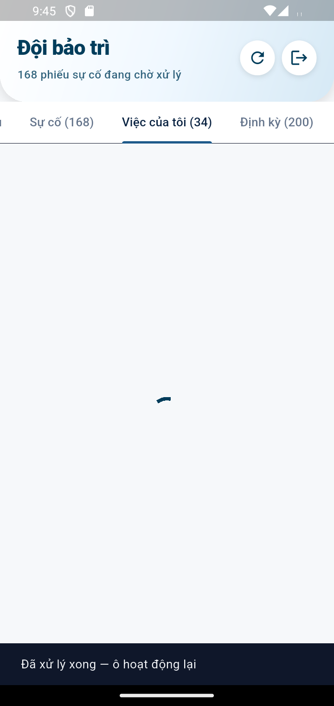
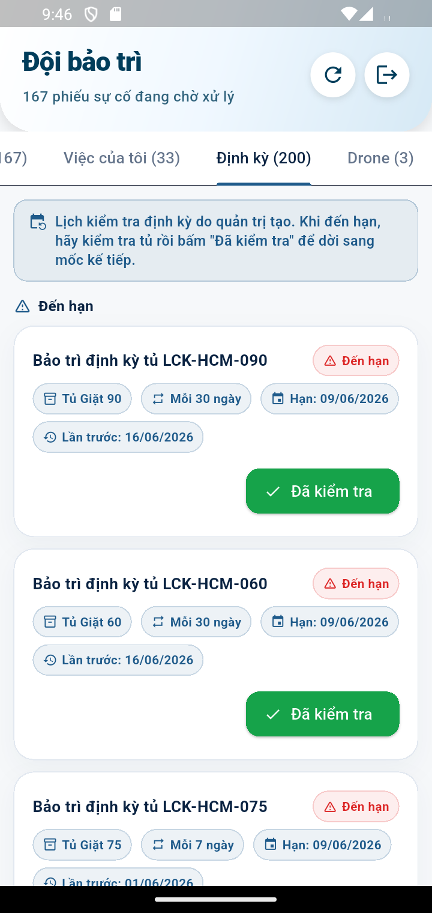

# Kịch bản 2 — Bảo trì (Maintenance): Xử lý phiếu sự cố tủ

**Vai trò:** MAINTENANCE (`se180211nguyenquocbaohuy@gmail.com`).
**Mục tiêu:** kiểm tra tủ, nhận & xử lý phiếu sự cố do khách báo, clear fault, và bảo trì định kỳ.

> **Kết nối với khách hàng:** khi khách bấm "Báo ô lỗi" (kịch bản Customer), một
> phiếu sự cố được tạo và xuất hiện ở tab **Sự cố** dưới đây. Khi bảo trì bấm
> **Hoàn tất**, khách nhận thông báo "đã sửa xong" và có thể đánh giá.

---

## Bước 1 — Kiểm tra tủ

Sau đăng nhập vào **Đội bảo trì**. Header ghi số phiếu đang chờ. 5 tab:
**Kiểm tra tủ · Sự cố · Việc của tôi · Định kỳ · Drone**.

Tab **Kiểm tra tủ**: chọn tủ → xem thống kê ô (Tổng/Sẵn sàng/Ô lỗi) và sơ đồ ô;
chạm một ô để báo hỏng / mở khẩn cấp / vệ sinh.

## Bước 2 — Tab Sự cố (hàng đợi phiếu)

Đầu tab là **Tổng quan ca trực**: số **Ô lỗi / Phiếu mới / Đang xử lý / Của tôi**.
Bên dưới là danh sách **ô đang lỗi vật lý** — mỗi ô ghi tủ, số ô, loại (XL/STANDARD/DRONE),
lý do (VD "Hỏng khóa điện tử"), địa chỉ, nút **Chỉ đường** và **Đã sửa**.

Cuộn xuống thấy thêm nhiều ô lỗi:

## Bước 3 — Đánh dấu "Đã sửa" (clear fault)

Bấm **Đã sửa** trên một ô lỗi → hệ thống clear fault, ô về trạng thái hoạt động:

Thông báo **"Ô đã hoạt động lại"**.

## Bước 4 — Việc của tôi (phiếu đã nhận)

Tab **Việc của tôi**: các phiếu do mình phụ trách (KTV #9003). Mỗi phiếu ghi:
mã phiếu, mô tả sự cố, tủ, **tên + SĐT khách báo cáo**, badge **Quá hạn SLA**,
số ngày mở, nút **Chỉ đường / Nhật ký / Hoàn tất**.

## Bước 5 — Hoàn tất phiếu (resolve → đóng vòng với khách)

Bấm **Hoàn tất** trên một phiếu → hệ thống resolve + clear fault:

Thông báo **"Đã xử lý xong — ô hoạt động lại"**. Đồng thời hệ thống **bắn thông báo
về khách hàng** đã báo cáo (khép kín vòng phản hồi).

## Bước 6 — Bảo trì định kỳ

Tab **Định kỳ**: lịch kiểm tra định kỳ do Admin tạo. Mỗi mục ghi tủ, chu kỳ
(mỗi N ngày), hạn, badge **Đến hạn**, và nút **Đã kiểm tra** (dời sang mốc kế tiếp):

> Tab **Drone** (không chụp ở đây) quản lý đội drone vật lý: trạng thái/pin/kỹ
> thuật viên phụ trách + công cụ Mission Planner / Flight Data (MAVLink).
