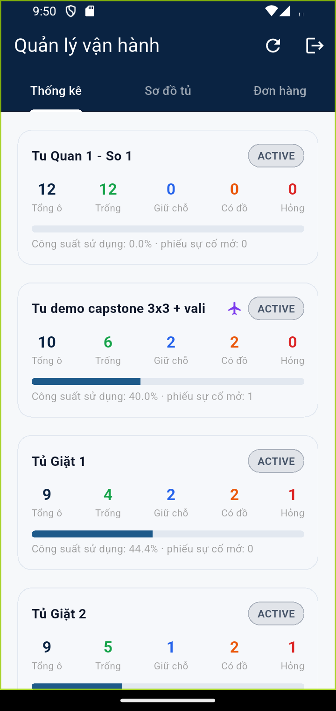
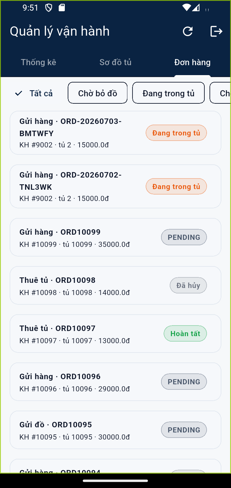
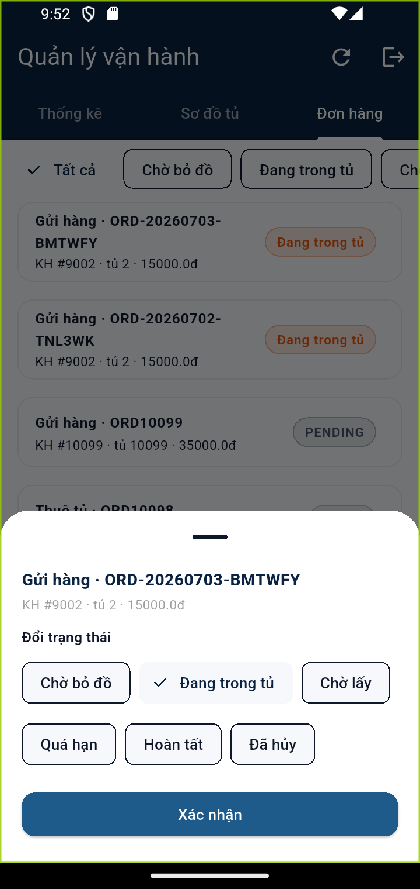

# Kịch bản 3 — Quản lý (Manager): Vận hành tủ & đơn hàng

**Vai trò:** MANAGER (`huynqbse180211@fpt.edu.vn`).
**Mục tiêu:** theo dõi công suất tủ và **đổi trạng thái đơn hàng**.

---

## Bước 1 — Thống kê tủ

Sau đăng nhập vào **Quản lý vận hành**, 3 tab: **Thống kê · Sơ đồ tủ · Đơn hàng**.

Tab **Thống kê**: mỗi tủ một thẻ với số **Tổng ô / Trống / Giữ chỗ / Có đồ / Hỏng**,
thanh **công suất sử dụng (%)** và số phiếu sự cố mở.

## Bước 2 — Danh sách đơn hàng

Tab **Đơn hàng**: bộ lọc theo trạng thái (Tất cả / Chờ bỏ đồ / Đang trong tủ / …)
và danh sách đơn — mỗi đơn ghi loại (Gửi hàng/Thuê tủ), mã đơn, khách (KH #id),
tủ, số tiền, và **badge trạng thái**.

## Bước 3 — Đổi trạng thái đơn

Chạm một đơn → **bottom sheet đổi trạng thái**: chọn một trong
**Chờ bỏ đồ · Đang trong tủ · Chờ lấy · Quá hạn · Hoàn tất · Đã hủy** rồi bấm
**Xác nhận**.

> Mỗi lần Manager đổi trạng thái được **ghi vào lịch sử đơn** (ai đổi, lúc nào)
> và khách hàng nhận thông báo. Endpoint: `PATCH /api/manage/orders/{id}/status`
> (gateway giới hạn MANAGER/ADMIN).
>
> *Lưu ý demo:* ảnh này chụp trên môi trường cục bộ dùng image order-service
> **cũ** (build trước khi endpoint đổi-trạng-thái được thêm) nên thao tác xác
> nhận trả lỗi; trên nhánh `develop` mới nhất tính năng hoạt động đầy đủ. Ảnh
> bottom sheet ở trên minh hoạ chính xác giao diện tính năng.
