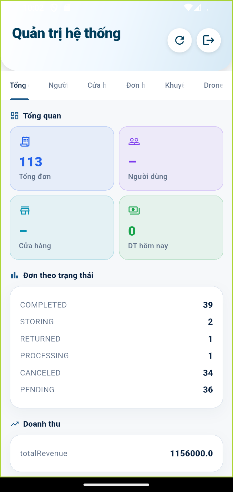
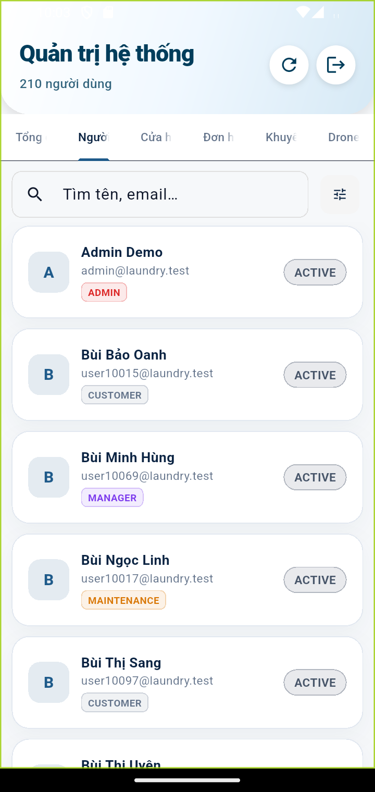
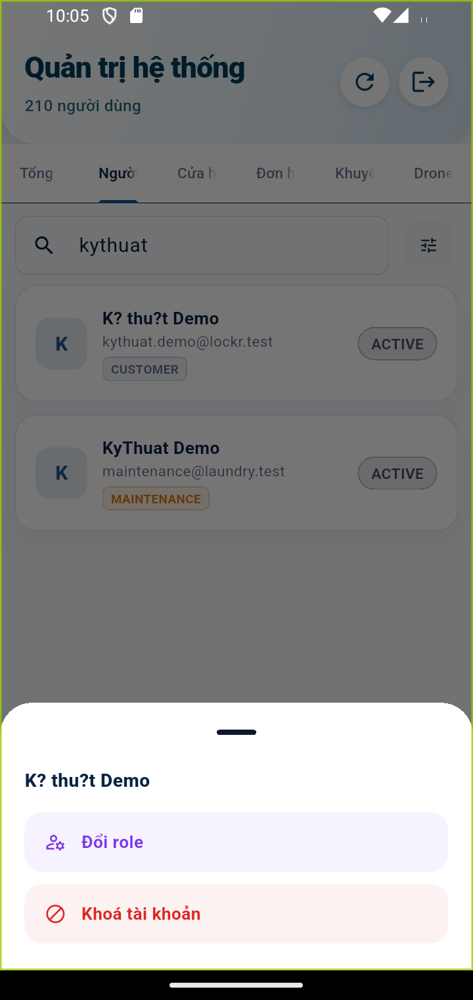
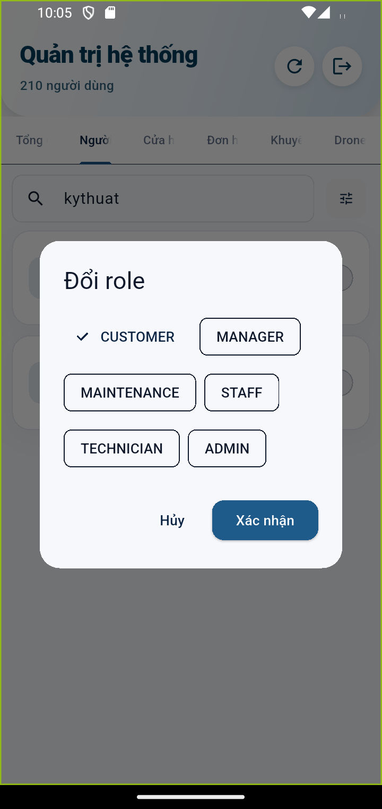
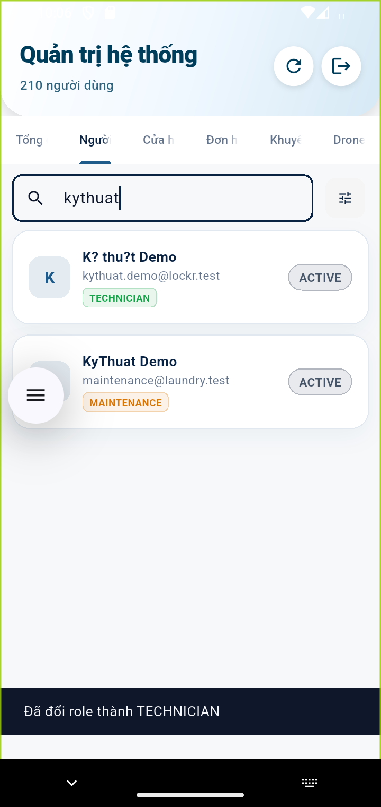
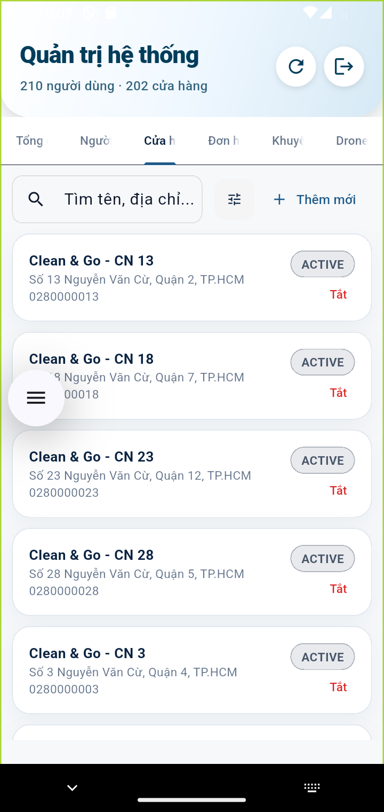
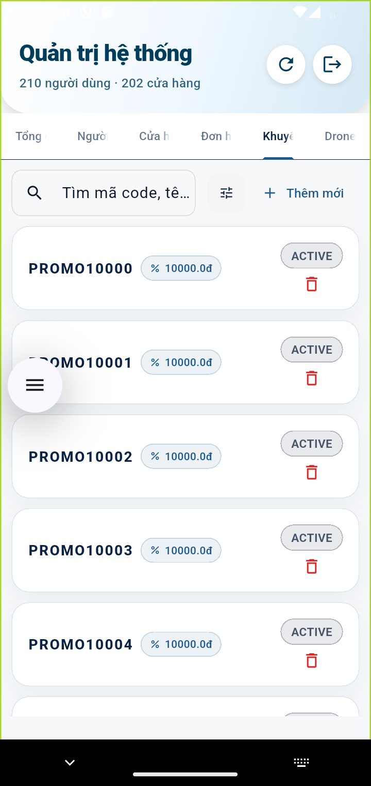

# Kịch bản 4 — Quản trị (Admin): Toàn hệ thống & cấp role

**Vai trò:** ADMIN (`baohuy2k12k4@gmail.com`).
**Mục tiêu:** xem tổng quan hệ thống, quản lý người dùng và **đổi role** (ví dụ nâng một khách lên TECHNICIAN — bàn giao cho [kịch bản Technician](05-ky-thuat-vien.md)).

---

## Bước 1 — Dashboard tổng quan

Sau đăng nhập vào **Quản trị hệ thống**, 6 tab: **Tổng quan · Người dùng · Cửa
hàng · Đơn hàng · Khuyến mãi · Drone**.

Tab **Tổng quan**: thẻ KPI (Tổng đơn / Người dùng / Cửa hàng / DT hôm nay),
bảng **Đơn theo trạng thái** (COMPLETED/STORING/RETURNED/PROCESSING/CANCELED/PENDING)
và **Doanh thu**.

## Bước 2 — Quản lý người dùng

Tab **Người dùng**: tổng số user, ô tìm kiếm + lọc, danh sách user với **chip role**
(ADMIN/MANAGER/MAINTENANCE/CUSTOMER…) và trạng thái **ACTIVE**.

## Bước 3 — Đổi role một tài khoản

Tìm user cần đổi → chạm thẻ → **bottom sheet hành động**: **Đổi role** / **Điều
chỉnh ví** / **Khoá tài khoản**.

> **Điều chỉnh ví** (đồng bộ với web): mở hộp thoại xem số dư hiện tại, nhập số
> tiền + lý do rồi **Cộng tiền / Trừ tiền** — gọi `GET/POST /api/admin/wallet/{userId}`.

Bấm **Đổi role** → hộp thoại chọn role: **CUSTOMER / MANAGER / MAINTENANCE / STAFF
/ TECHNICIAN / ADMIN**. Chọn **TECHNICIAN** rồi bấm **Xác nhận**:

Kết quả: thông báo **"Đã đổi role thành TECHNICIAN"** và chip của user đổi từ
CUSTOMER sang **TECHNICIAN**:

> ➡️ **Bàn giao:** user này đăng xuất và đăng nhập lại sẽ vào thẳng **Technician
> Home** — xem [05-ky-thuat-vien.md](05-ky-thuat-vien.md).

## Bước 4 — Quản lý cửa hàng

Tab **Cửa hàng**: tổng số cửa hàng, tìm kiếm, nút **Thêm mới**, danh sách cửa hàng
với địa chỉ/SĐT, trạng thái **ACTIVE** và nút **Tắt/Bật**.

## Bước 5 — Quản lý khuyến mãi

Tab **Khuyến mãi**: danh sách mã (PROMO…), loại giảm giá, trạng thái **ACTIVE**,
nút **Thêm mới** và biểu tượng xóa từng mã.

> Mã tạo ở đây dùng được khi khách nhập ở màn Gửi hàng/Thuê tủ.
