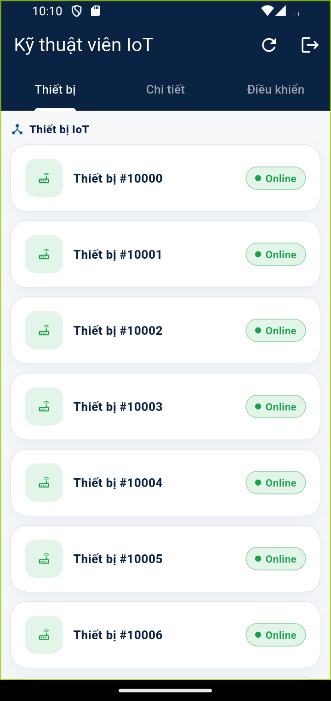
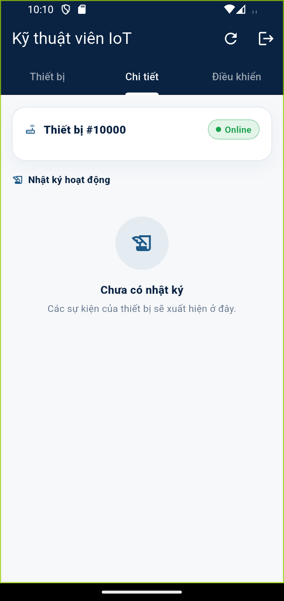
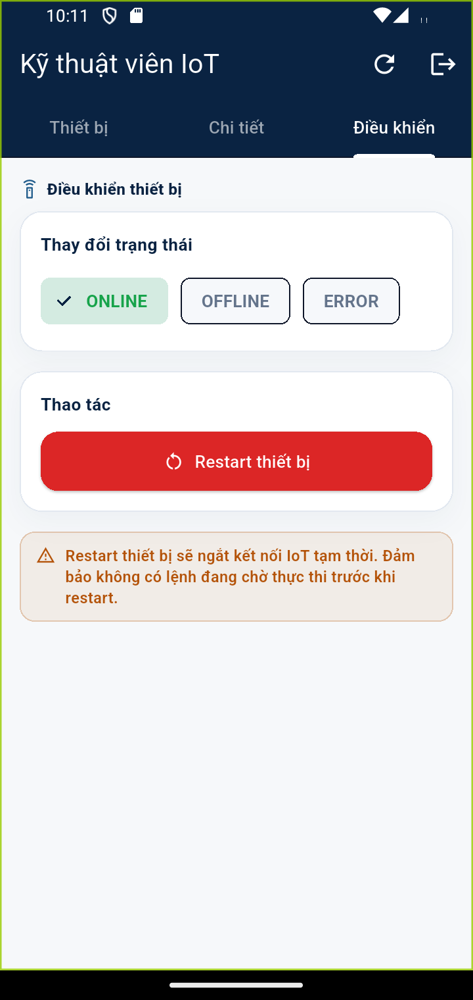

# Kịch bản 5 — Kỹ thuật viên (Technician): Quản lý thiết bị IoT

**Vai trò:** TECHNICIAN — tài khoản khách được Admin đổi role sang TECHNICIAN ở
[kịch bản Admin, Bước 3](04-admin.md). Sau khi đổi role, user đăng nhập lại vào
thẳng màn này.
**Mục tiêu:** xem danh sách thiết bị IoT (cabinet), xem chi tiết + nhật ký, và điều khiển/restart thiết bị.

---

## Bước 1 — Danh sách thiết bị

Sau đăng nhập vào **Kỹ thuật viên IoT**, 3 tab: **Thiết bị · Chi tiết · Điều khiển**.

Tab **Thiết bị**: danh sách thiết bị IoT (cabinet) với badge trạng thái
**Online / Offline / Lỗi**.

## Bước 2 — Chi tiết thiết bị

Chạm một thiết bị → tab **Chi tiết**: thông tin thiết bị (model/firmware/IP/MAC/vị
trí/last-seen) và **Nhật ký hoạt động** (các sự kiện của thiết bị).

## Bước 3 — Điều khiển thiết bị

Tab **Điều khiển**:
- **Thay đổi trạng thái**: ONLINE / OFFLINE / ERROR.
- **Thao tác**: nút **Restart thiết bị** (đỏ) — gửi lệnh restart qua MQTT, luôn ghi audit log.
- Banner cảnh báo: "Restart sẽ ngắt kết nối IoT tạm thời…".

> Đây là vai trò kỹ thuật riêng cho thiết bị IoT, khác với **Maintenance** (bảo
> trì ô tủ/phiếu sự cố). Endpoint: `/api/technician/devices/**`.
