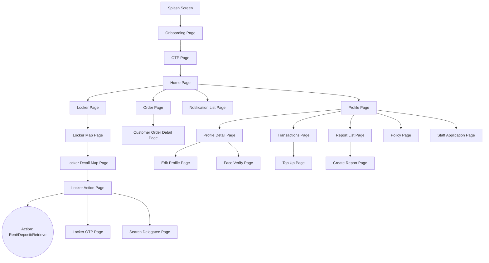
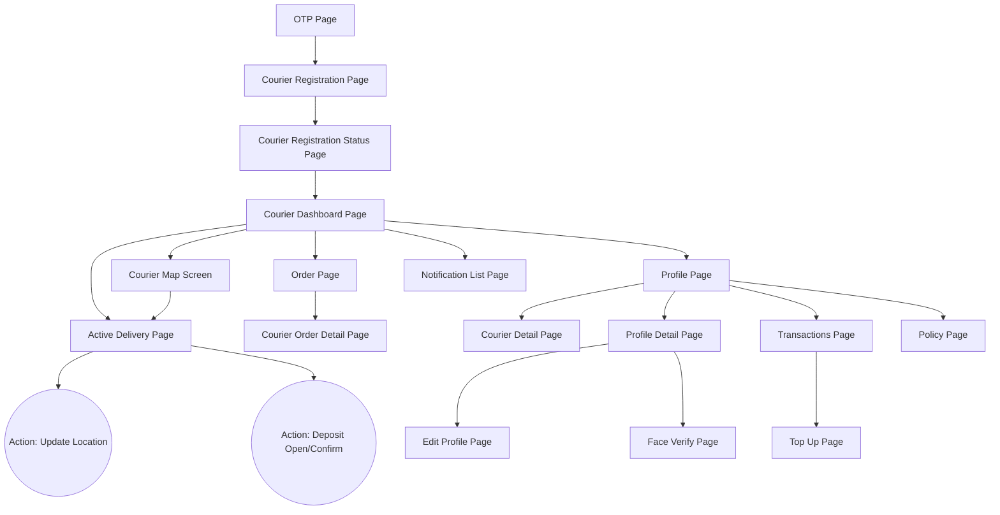

# AISL App Screen Flow Diagrams

Tài liệu này cung cấp các sơ đồ luồng màn hình (Screen Flow Diagrams) cho cả 2 vai trò khách hàng (Customer) và người giao hàng (Courier) được quét trực tiếp từ cấu trúc file source code của ứng dụng.

**Quá trình scan trực tiếp từ codebase `/lib/features/` đã xác định chính xác các màn hình thực tế (không dùng thông tin mẫu từ Internet):**
- **Hình chữ nhật `[]`**: Tượng trưng cho các màn hình (Screens / Pages) vật lý thực tế được định nghĩa trong codebase (đuôi `_page.dart` hoặc `_screen.dart`).
- **Hình oval (viên thuốc) `(())`**: Tượng trưng cho các actions (Hành động).

---

## 1. Customer Screen Flow (Luồng Màn Hình Khách Hàng)

Trang `Home Page` là trung tâm để khách hàng rẽ nhánh sang việc tra cứu vị trí tủ (Map Location), xem đơn hàng (Order/Order Detail), ví tiền (Transactions), báo cáo lỗi (Report List) cũng như đăng ký làm nhân viên (`Staff Application Page`).

---

## 2. Courier Screen Flow (Luồng Màn Hình Người Giao Hàng)

Luồng giao hàng (Courier) bắt đầu từ việc đăng ký để trở thành Courier, xem Dashboard & Map để nhận chuyến giao hàng (Active Delivery), và vào các chi tiết đơn hàng dành riêng cho Courier.

